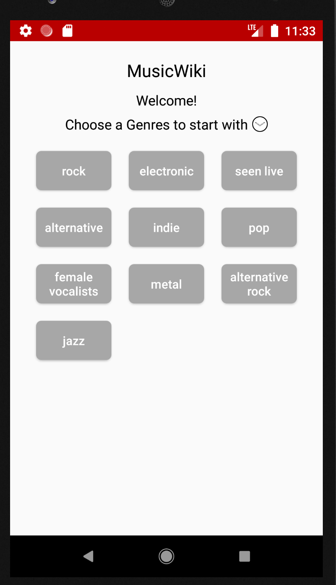
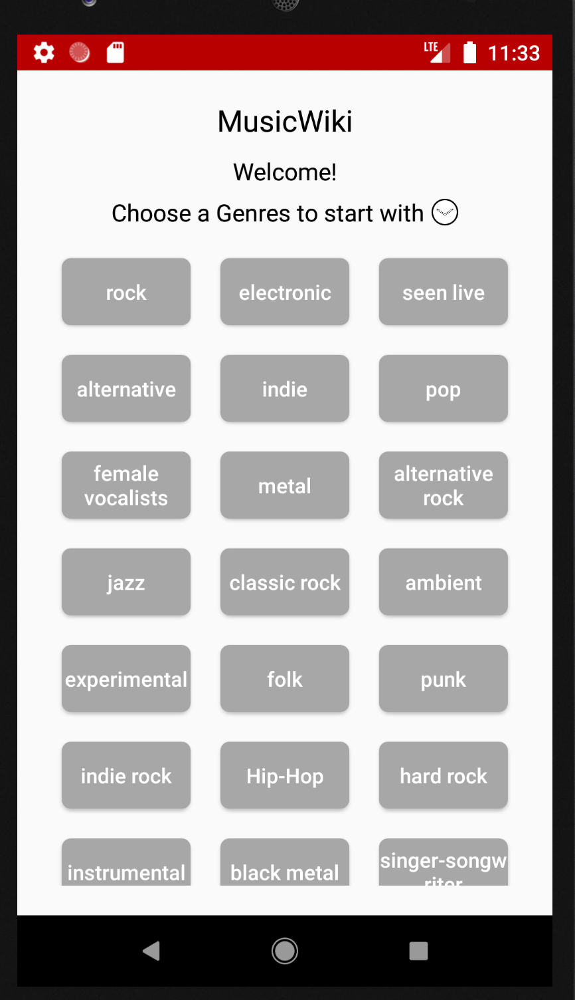
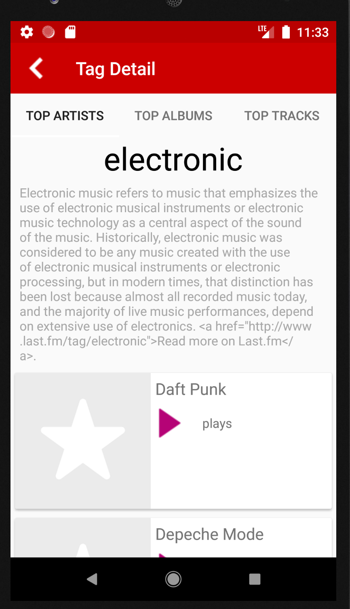
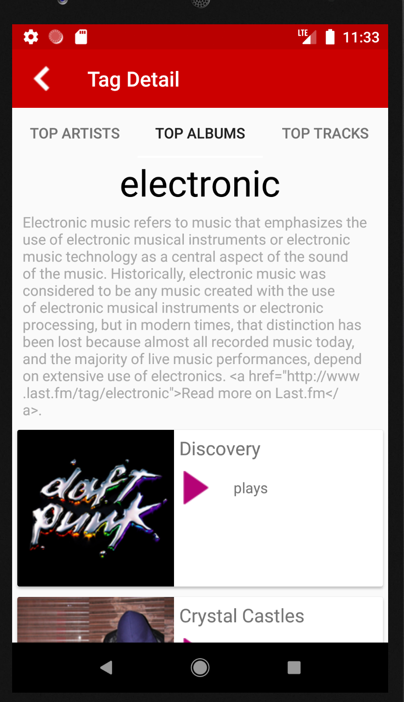
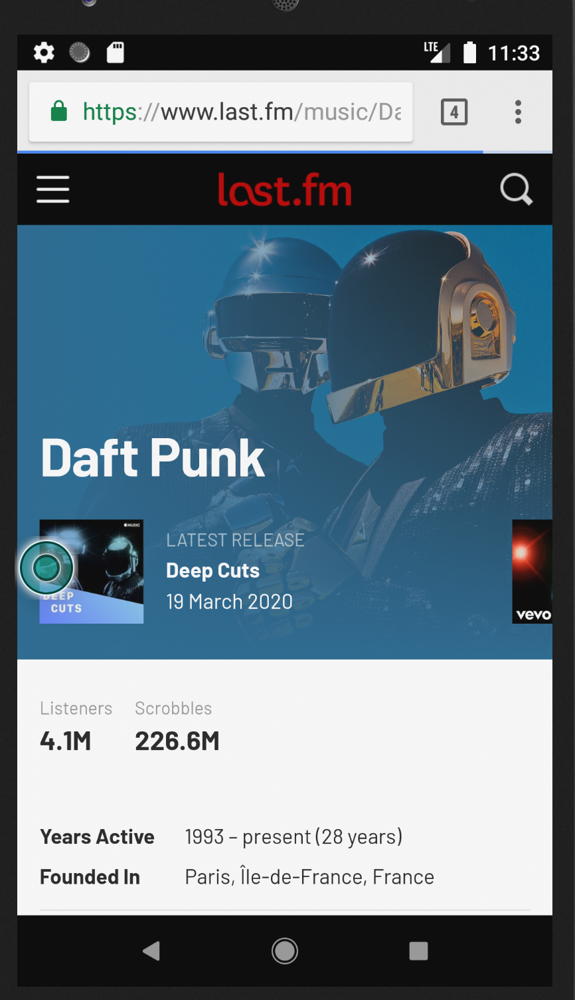

# MusicWiki Top 10

## App Description:
The app simply displays the top tags list and selected tag top 10 albums, artists and tracks for a last.fm user.

## Technical Description:
*	The app is structured in MVVM.
* The app uses last fm's APIs to get the user top lists.
*	To be able to use their APIs you need first to create an API key.
  Visit: https://www.last.fm/api/account/create
*	You can use methods to get top artists,  etc..
*	To not only display top tens you can extend the limit for each request as much as you want but with max 50 records per call by changing the value of TOP_ITEMS_LIMIT to 50 in Constants.Java file.
*	I have used databinding to write declarative layouts
*	I have used Dagger2 to inject dependencies in userslisting module.
*	I have used 3rd party libraries like RxJava/RxAndroid 2, Dagger2,and Retrofit2,Glide.
*	you can download an apk file for the app here.

